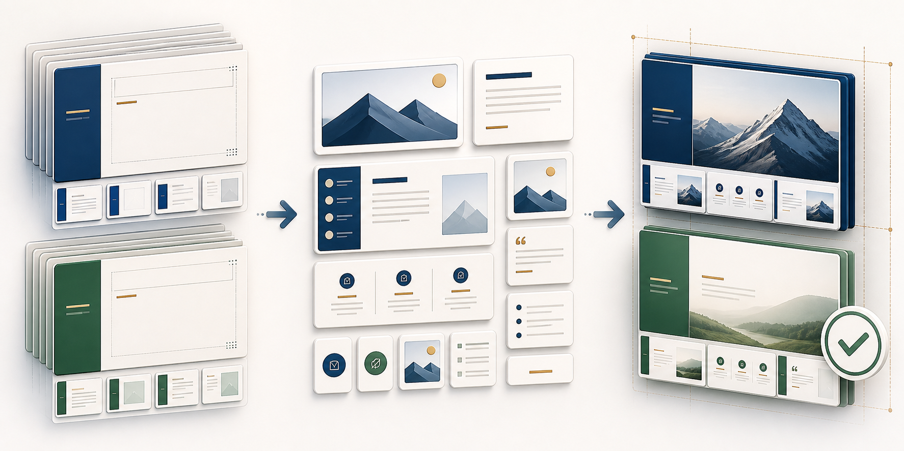

# pptskills



一套“**统一母版、模板优先**”的 PowerPoint 工作流。它不让模型从零发明整页版式，而是把稳定质量拆成两层：

> **一个真实母版家族 + 一个已审核内容模块 + 文案/图片替换 = 一张可验证的 PPT 页面**

上图从左到右展示了核心流程：先锁定母版家族，再选择标题以下的内容模块，只替换文案与图片，最后通过母版、几何、容量、素材和渲染检查交付。图为本项目原创生成视觉，不含真实任务数据或第三方标识。

## 公开内容

- 2 个脱敏母版家族：`通用蓝白` 与 `通用青绿`；
- 57 个活动内容模块及容量/几何合同；
- 模板研发的 `draft → revise → approved/rejected → 合同化 → 验证 → active` 全流程；
- 只负责复制、挂载、替换、备注、图片来源、渲染和验证的机械工具；
- Codex skill：`.codex/skills/template-first-ppt/`。

## 为什么是模板优先

- **母版统一**：封面、目录、章节、正文标题区与结尾保持一个视觉身份。
- **模块复用**：正文只复用已审核的标题以下结构，不在任务稿里临时排版。
- **容量有合同**：标题行数、字号语法、文本上下限、图片框和几何都可机械检查。
- **素材可追溯**：正式任务必须替换为真实、独立、可核验的图片与准确图注。
- **交付可验证**：结构验证之后仍要全页渲染和目视复核。

## 隐私边界

公开模板中的原始文案、研究数据、人物照片、机构标识、备注、批注、作者信息、绝对路径和外部链接均已移除或替换为中性占位内容。仓库不包含任务成品、研究原稿、素材源文件或内部审核记录。

使用模板时，请把图片占位替换为真实、可追溯且有授权的素材，并重新填写准确图注和来源。

## 目录

```text
模板/母版/              # 脱敏母版家族与 family.json
模板/模块/内容/         # 活动模块合同
模板/模块/源页/         # 脱敏模块源页
模板研发部门/已审核/    # 脱敏研发模块源页
script/                 # 机械组合、替换、审计和验证工具
.codex/skills/          # 可直接使用的 template-first-ppt skill
```

## 快速验证

```powershell
pip install -r requirements.txt
python script/template_ppt.py verify-master --input "模板/母版/通用蓝白/母版源.pptx" --family "模板/母版/通用蓝白/family.json"
python script/template_ppt.py verify-master --input "模板/母版/通用青绿/母版源.pptx" --family "模板/母版/通用青绿/family.json"
```

验证某个模块：

```powershell
python script/template_ppt.py verify-module --module "模板/模块/内容/<模块>.module.json" --family "模板/母版/通用蓝白/family.json"
```

完整哲学、边界与流程见 `AGENTS.md`；可执行 skill 见 `.codex/skills/template-first-ppt/SKILL.md`。
